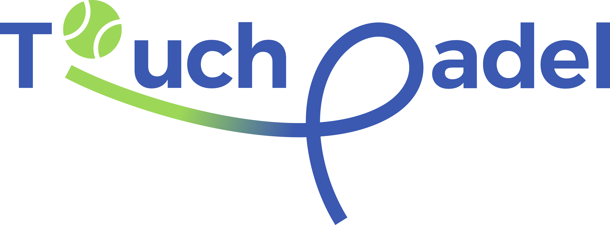

# Touch Padel — Style Reference

**The one file to open before you make anything new for Touch Padel:** a screen, a feature, a
poster, a social post, a slide, a sticker, an email, an icon.

It collects what the 2026 brand decks say and what the shipped apps already do. When something
here disagrees with an old mockup, a screenshot, or your memory of the deck, **this file and the
token files it points to win.**

| Source | What it governs |
|---|---|
| `docs/brand/full-brand2.pdf` (2026 deck, "Visual Identity 1st 2026") | Brand story, voice, logo, colour values, icons, print applications |
| `docs/brand/identity.pdf` (earlier deck) | Pattern artwork (p8), typography board, poster layouts |
| `docs/brand/cafe/p01–p16.png` | Touch Cafe sub-brand boards |
| `packages/ui/src/tokens/*.ts` | Web + operator tokens (the code source of truth) |
| `apps/mobile/src/theme/tokens.ts` | Guest mobile app tokens (light + "blue mode") |
| `docs/DESIGN.md` · `docs/PRODUCT.md` | Operator desktop design rules and product register |

> PDFs are gitignored (too large for GitHub). If a deck isn't next to this file, ask Parsa for it.

---

## 1 · The brand in one breath

> **Touch Padel is a modern padel court brand delivering a premium playing experience.**
> Designed for players who value precision, flow, and the true touch of the game, it combines
> high-quality courts, smart design and an energetic atmosphere: performance-driven spaces,
> accessibility, and a seamless, player-focused experience. *(deck, "About")*

**Tagline:** **TOUCH IS A LIFESTYLE**

**Brand voice: five words.** The deck draws them on the seams of a padel ball:

| Word | What it means when you design |
|---|---|
| **ENERGETIC** | Diagonal lines, athletes caught mid-swing, a ball in flight. Nothing static or symmetrical for the sake of it. |
| **PRECISE** | Exact brand colours, exact artwork, tight grids, tabular numbers. Never eyeball anything. |
| **PROFESSIONAL** | Clean, confident, uncluttered. Premium sports club, not a local flyer. |
| **DYNAMIC** | The swoosh, the crossing court lines, motion blur on the ball. |
| **CREATIVE** | The ball stands in for the "o", the swoosh draws the "P". Wit in the details, never clip-art. |

**Mood in one line:** *night-session padel under floodlights.* Deep blue court, a lime-green ball,
white lines, black around it. Athletic, confident, direct, premium.

**It is not:** playful or cartoonish, pastel, corporate-grey, luxury gold, "tech startup" purple
gradients, glassmorphism, neon cyberpunk.

---

## 2 · Logo



### 2.1 Anatomy: three pieces, one idea

The deck's concept board is titled **"FOCUS O & P"**: the two letters the logo replaces.

| Piece | What it is | Colour |
|---|---|---|
| **Wordmark** | `T · uch · adel` in a geometric heavy sans. Custom outlines, never retyped in a font. | Touch Blue `#3360AB` (on light) / White (on dark) |
| **Ball** | A padel ball with two seams **replaces the "o"** of Touch. It is the brand's atom. | Padel Green `#A5D06F` segments with a **white** seam disc behind them |
| **Swoosh** | Starts under the ball as a ball trajectory, sweeps under "uch", then **loops up to draw the "P"** of Padel. | Gradient **Padel Green → Touch Blue** (the *only* gradient in the system) |

### 2.2 Files

| Asset | Path | Use |
|---|---|---|
| Colour lockup, transparent PNG (5170×1906) | `docs/brand/touch_padel_logo_transparent.png` | Print, decks, anything on white / light |
| Colour lockup on white PNG | `docs/brand/touch_padel_logo_white.png` | Same art with an opaque white ground |
| Web copy | `apps/web/public/brand/touch_padel_logo_transparent.png` | Website |
| Mobile colour / white (900×332) | `apps/mobile/assets/logo.png`, `logo-white.png` | App |
| App icon (1024) + adaptive + monochrome | `apps/mobile/assets/icon.png`, `adaptive-icon*.png` | Stores, launchers |
| Web icons | `apps/web/public/brand/icon-192.png`, `icon-512.png` | PWA / favicon |
| **Vector lockup (React/SVG)** | `apps/operator/src/components/brand.tsx` → `BrandLockup`, `BrandBall`, `BrandSwoosh` | **Preferred for any web/HTML work.** These are the deck's own beziers, not a redraw |
| Vector lockup (React Native) | `apps/mobile/src/components/LogoMark.tsx` (+ `features/courtTransition/logoPaths.ts`) | Mobile |
| Notification glyph | `apps/mobile/assets/brand/notification.svg` | Android status bar |

**Need an SVG file?** Copy the path data out of `brand.tsx`. Its viewBox is `0 0 72.55 26.78`.
Never trace the PNG.

### 2.3 Approved colour versions

These are the six from the deck's "Applications" logo page:

| Ground | Wordmark | Ball | Swoosh |
|---|---|---|---|
| **White / light** (primary) | Touch Blue | Green, white seams | Green → Blue |
| **Touch Blue** | White | Green, white seams | Green → White |
| **Black** | White | Green, white seams | Green → White |
| **Padel Green** | Touch Blue | White, green seams | White → Blue |
| **Brand Gray** | Black | Black, gray seams | Solid black (one-colour) |
| ~~Teal~~ | | | *Retired with the teal colour* |
| **Single colour** (splash, stickers, emboss, favicon) | White *or* Blue *or* Black | Three arcs, ground showing through as the seam | Solid, same colour |

The full-colour lockup on white is the default. On any blue, navy or black ground, use the white
wordmark with the green → white swoosh. *(The operator's `BrandLockup tone="onDark"` keeps
green → blue on the navy rail. For new work, follow the deck.)*

### 2.4 Logo rules

**Do**
- Keep the whole shape. The "P" loop must be complete. A cropped swoosh stops reading as a "P".
- Keep the ball's white seam disc in colour versions. Without it the seams show the ground and look like cracks.
- Size by height. Keep the lockup at **≥ 24 px tall** on screen and **≥ 25 mm wide** in print.
- Leave clear space at least **one ball diameter** on every side. *(House rule. The deck shows a construction grid but no number.)*
- Use the **ball alone** as the small mark when the lockup won't fit. It holds up at 14 px.

**Don't**
- Retype "Touch Padel" in a font and call it the logo. In running text, write **Touch Padel** in the body face.
- Recolour pieces outside §2.3, add shadows, outlines, glows, bevels, or put the gradient on the wordmark.
- Stretch, skew, rotate, or rearrange the pieces (e.g. ball on the right, swoosh removed).
- Place the colour lockup on a busy photo. Use a solid block or the white version on a dark area.
- Use a generic tennis-ball emoji or clip-art ball in its place.

**Where it appears in product UI** (operator, and a good default elsewhere): boot/splash,
sign-in, the navigation rail head, the lock screen, the kitchen display masthead, print. **Never
inside data** (tables, cards, lists). The ball may spin as a *busy* indicator at medium and large
sizes only, and only while something is actually pending.

### 2.5 Sub-brand: Touch Cafe

Same system and same wordmark construction: **"T·uch Cafe"**. The "o" is a **coffee bean**, and a
smile-shaped swoosh runs under the word and hooks into the "C". Boards are in `docs/brand/cafe/`.
Web components are in `apps/web/src/components/cafe/brand/` (`Wordmark`, `BeanMark`,
`BeanPattern`, `Swoosh`).

> ⚠️ The cafe deck shows **coffee brown** and a slightly different blue. In the product, **brown is
> retired**. The approved cafe menu uses **Touch Blue `#3360AB` + Padel Green `#A5D06F`**, the same
> as padel. Do not bring brown back.

---

## 3 · Colour

### 3.1 The palette is closed: five colours

Owner decision, 2026-09-05. **These five exist and nothing else is a brand colour.**

| Swatch | Name | HEX | RGB | CMYK | OKLCH |
|---|---|---|---|---|---|
| 🟦 | **Touch Blue** | `#3360AB` | 51 / 96 / 171 | 70 / 44 / 0 / 33 | `oklch(49.65% 0.13 260.02)` |
| 🟩 | **Padel Green** (deck: "Light Padel Green") | `#A5D06F` | 165 / 208 / 111 | 21 / 0 / 47 / 18 | `oklch(80.51% 0.134 128.68)` |
| ⬜ | **Brand Gray** (deck: "Neutral Gray") | `#BCBDBF` | 188 / 189 / 191 | 2 / 1 / 0 / 25 | `oklch(79.82% 0.003 264.54)` |
| ⬛ | **Black** | `#000000` | 0 / 0 / 0 | 0 / 0 / 0 / 100 | |
| ⬜ | **White** | `#FFFFFF` | 255 / 255 / 255 | 0 / 0 / 0 / 0 | |

**The shade rule.** Need a lighter or darker step? Take **the same hue and saturation and change
only lightness.** Never eyedrop from a photo, never "pick something close". All the ramps in §3.4
were built this way.

**Allowed exceptions (functional, not identity):**
1. **Status red and amber**, for errors and warnings only (§3.5).
2. **Categorical chart colours**, where data needs hue separation (§3.6).
3. **Operator's tinted neutrals**: paper and ink tinted toward the blue hue (§3.4).
4. **Third-party marks** (Google "G", Apple): their own colours, never recoloured.

**Retired: do not use.** These show up in old decks, mockups and git history:

| Value | Where it came from | Why it's gone |
|---|---|---|
| Teal `#1FA79A` (and deck teal fields) | 2026 deck palette page, pattern and roll-up applications | Palette closed to five. The swoosh now runs green straight into blue. |
| `#2456B4`, `#7FB05A` | Old cafe palette | Drift. Cafe uses the exact brand blue and green. |
| Coffee brown (`#603813` family) | Cafe deck | Not in the approved menu. Green replaced it. |
| `#3057A3`, `oklch(47% 0.13 262)` | Old operator accent | An eyeballed "brand blue". Wrong hue. |
| `#0D1830` navy | Old mobile dark mode | Hue 221, not the brand. Replaced by "blue mode". |

### 3.2 How much of each: the proportion

| Colour | Role | Rough share |
|---|---|---|
| **Touch Blue** | The brand's ground and its primary action. Courts, hero fields, primary buttons, links, selection, focus rings. | Dominant on brand surfaces; **< 10%** on product/data screens |
| **Padel Green** | The spark. The ball, the pattern lines, the title squiggle, the big "go" CTA, the second line of a headline, *live / ready / success*. | Accent: **5–15%** |
| **White** | Paper, type on blue, court lines. | Large |
| **Black** | Photography grounds, poster backgrounds, ink on green. | Marketing: large · Product: text only via ink tokens |
| **Brand Gray** | Secondary text on dark, quiet fields, one of the logo grounds. | Small |

**Green is a word, not a decoration, inside product UI.** It means *live, ready, arrived,
available, success, go*. Don't spend it on a random chart line or a divider.

### 3.3 Pairings that work (WCAG contrast)

| Foreground on ground | Ratio | Verdict |
|---|---|---|
| White on Touch Blue | **6.17:1** | ✅ Body text and buttons |
| **Black on Padel Green** | **11.85:1** | ✅ **The** CTA pairing |
| Deep blue ink `#162A4B` on Padel Green | 8.08:1 | ✅ Active pills, labels on green |
| Padel Green on Black | 11.85:1 | ✅ Posters, headlines |
| Padel Green on navy `#172C4F` | 7.85:1 | ✅ Headline accents in blue mode |
| Black on Brand Gray | 11.17:1 | ✅ |
| Touch Blue on white-ish `#F3F5F9` | 5.66:1 | ✅ Links, accents |
| Padel Green on Touch Blue | 3.48:1 | ⚠️ Large display text, icons, lines only |
| Touch Blue on Padel Green | 3.48:1 | ⚠️ Large/bold only |
| **White on Padel Green** | **1.77:1** | ❌ **Never.** Text on green is black or deep blue ink |
| White on Brand Gray | 1.88:1 | ❌ Never |

Floors: body text **4.5:1**, large text and UI boundaries **3:1**. Status is **never colour
alone**: always a label or icon too.

### 3.4 Theme palettes (use the tokens, don't retype)

**Guest mobile app, light** (`apps/mobile/src/theme/tokens.ts` → `palettes.light`)

| Token | Value | Use |
|---|---|---|
| `bg` | `#F3F5F9` | Screen ground |
| `card` / `page` | `#FFFFFF` | Cards, full-bleed pages |
| `sub` | `#EDF0F5` | Subdued fills, secondary buttons |
| `tint` | `#EFF3FA` | Blue-tinted chips, badges |
| `line` / `line2` | `#E2E8F2` / `#D6DEEA` | Hairlines |
| `ink` | `#1B2C47` | Primary text (14.0:1) |
| `mut` / `mut2` | `#5A6D8C` / `#41567A` | Secondary text |
| `fnt` → `fnt3` | `#8495B2` → `#C3CCDB` | Labels → placeholders → disabled |
| `blue` | `#3360AB` | Primary interactive |
| `gtint` / `gline` / `gtext` / `gstrong` | `#ECF6DF` / `#C7E3A4` / `#426318` / `#527F19` | Green (success) family |
| `amb` / `ambtext` | `#FAF1DC` / `#6B4E0A` | Warning family |
| `redtint` / `redtext` / `danger` | `#FBEAE8` / `#B42318` / `#B42318` | Error family |

**Guest mobile app, dark = "blue mode"** (`palettes.dark`). Every blue is an exact shade of
`#3360AB` (hue 217.5°, sat 54.05%, only lightness moves). It should read as *the brand at night*,
not as "dark mode".

| Token | Value | Lightness |
|---|---|---|
| `page` | `#172C4F` | L20 |
| `bg` | `#1C355E` | L24 |
| `card` | `#224072` | L29 |
| `sub` | `#274982` | L33 |
| `line` / `line2` | `#2D5495` / `#3360AB` | L38 / brand |
| `ink` | `#FFFFFF` | |
| `mut` | `#BCBDBF` | brand gray |
| `blue` (accent) | **`#FFFFFF`** | Blue can't carry text on blue, so the accent turns white |
| `gtext` | `#A5D06F` | brand green |
| `redtint` / `redtext` / `danger` | `#4A2A3A` / `#E9A6AA` / `#C93B30` | Muted dusky rose; strong red only for truly destructive fills |

**Theme-invariant brand constants** (`brand` in the same file): CTA `#A5D06F` with ink `#000000`.
Navy success screen `#172C4F`, card `#1E3966`. Welcome gradient (168°) `#274982 → #3360AB →
#2D5495`. Scrims `#00000066` / `#00000080`.

**Website + public pages** (`packages/ui/src/tokens/palette.ts` → `padelPalette`):
bg `#FFFFFF` · fg `#000000` · surface `#F6F6F6` · accent `#3360AB` · accent-2 `#A5D06F` ·
muted-fg `#5C5E61` · border `#DADBDC` · danger `#B42318`.

**Cafe menu / QR ordering** (`cafePalette` + `cafeBrand.ts`): bg `#FFFFFF` · ink `#162A4B` ·
surface band `#EFF3FA` · rule `#E4EBF7` · accent `#3360AB` · hover `#274982` · green `#A5D06F` /
light `#BCDC93` / tint `#F5FAF0` · sky stroke `#7D9FD8` · page ground `#EAEAEB`.

**Operator desktop** (`packages/ui/src/tokens/operator.ts`): OKLCH neutrals tinted to hue 260.02,
never pure black or white. Paper ground `oklch(96.5% 0.005 260)`, panel `oklch(99.4% …)`,
ink `oklch(22% 0.03 260)`. The **navy rail** `oklch(25% 0.05 260)` is the one committed brand
surface. It carries the court-line motif. The kitchen display is the one dark, loud surface
(`--tp-kds-*`).

### 3.5 Status colours

| Meaning | Light fill / text | Where |
|---|---|---|
| Success, live, ready, arrived | `#ECF6DF` / `#426318` · mark = Padel Green | Everywhere |
| Warning, degraded, ageing | `#FAF1DC` / `#6B4E0A` | Everywhere |
| Error, cancelled, void | `#FBEAE8` / `#B42318` | Everywhere |

The operator uses four rungs per status: **fill** (big ground), **soft** (label ground), **mark**
(dots, icons, 2 px rules, ~58% L so a 7 px dot is still visible), and **fg** (text on soft).

### 3.6 Charts

Categorical series, in order: `#3360AB`, `#7C7F94`, `#1F7A8C`, `#8C5BA8`, `#B0763B`.
**Padel Green is not a series.** It's reserved for *"this one is the peak"* highlights.
Heat ramp: `#F2F3F7 → #DDE3EF → #BFCCE4 → #97AED4 → #6B8AC0 → #3360AB`. Grid `#DADEE5`,
axis `#565E6C`.

### 3.7 The one gradient

**Padel Green → Touch Blue** along the swoosh path. On dark grounds it becomes green → white, and
on green it becomes white → blue (§2.3). It fills **the swoosh and nothing else**:
not text, borders, buttons, dividers, backgrounds, or chart series. The only other blend in the
system is the Welcome screen's 3-step blue ramp (§3.4).

### 3.8 Copy-paste tokens

```css
:root {
  /* the closed palette */
  --tp-brand-blue:  #3360AB;
  --tp-brand-green: #A5D06F;
  --tp-brand-gray:  #BCBDBF;
  --tp-brand-black: #000000;
  --tp-brand-white: #FFFFFF;

  /* derived shades (same hue, lightness only) */
  --tp-blue-deep:   #274982;  /* hover / pressed, L33 */
  --tp-blue-navy:   #172C4F;  /* deep brand ground, L20 */
  --tp-blue-ink:    #162A4B;  /* body ink on light, ink on green */
  --tp-blue-tint:   #EFF3FA;  /* blue section band, L96 */
  --tp-green-light: #BCDC93;
  --tp-green-tint:  #ECF6DF;
  --tp-green-text:  #426318;  /* green you can read on white */

  /* functional */
  --tp-danger: #B42318;
  --tp-warn-bg: #FAF1DC;  --tp-warn-fg: #6B4E0A;
}
```

In the repo, **import the tokens** (`@touch/ui` theme vars, or `useTheme()` on mobile). Components
never contain a raw hex.

---

## 4 · Typography

### 4.1 One family, both scripts: **Lama Sans**

Lama Sans carries **Latin and Arabic in the same files**, so switching language never switches
font. Files: `packages/ui/fonts/lama/` (WOFF2 for web, TTF for mobile). Full notes:
`docs/brand/lama-sans/README.md`.

| Weight | Face | Use |
|---|---|---|
| 400 | Regular | Body copy |
| 400 italic | RegularItalic | Muted note lines only |
| 500 | Medium | Labels, table headers |
| 600 | SemiBold | Buttons (operator), headings, chips |
| 700 | Bold | Headings, totals, emphasis |
| 800 | ExtraBold | Button labels (mobile), section labels, cafe display |
| 900 | Black | **Page titles, hero headlines, posters** |

Fallback stack: `'Lama Sans', system-ui, -apple-system, 'Segoe UI', Tahoma, 'Noto Sans Arabic', Arial, sans-serif`.
Mono (order refs, codes only): `'Cascadia Code', 'SF Mono', Consolas, 'Roboto Mono', monospace`.

> The 2026 deck's typography board names **Next Art** (Latin) + **Frutiger LT Arabic**. Lama Sans
> is what Touch supplied and what every app uses. For anything digital or new, use Lama Sans. Only
> use the deck pair when extending existing print artwork set in them.

### 4.2 The signature headline treatments

**A. The page title (app).** Weight **900**, **UPPERCASE**, tight tracking (−0.01em), line-height
1.05. A **green hand-drawn squiggle** sits under it on the leading edge: 76×8, 3.5 stroke, round
caps, path `M2 6C22 1 50 1 74 4.5` (`TitleSquiggle`).

```
BOOK A COURT
‾‾‾‾‾‾‾  ← Padel Green squiggle
```

**B. The two-weight poster headline (marketing).** Line one is light/regular, line two is heavy.
Usually on black or blue, often with **the heavy line in Padel Green**:

```
TOUCH IS            ← regular, white
A LIFESTYLE         ← black/heavy, green

YOUR GAME           ← light, blue
YOUR CHALLENGE      ← heavy, blue
```

**C. The stacked one-word triplet.** `PLAY / SMASH / WIN`: big, all-caps, one word per line, with
the middle word emphasised.

**D. Micro / section labels.** 11 px, weight 800, UPPERCASE, +0.1em tracking, muted colour
("UPCOMING", "PAST").

### 4.3 Scales

| Surface | Scale |
|---|---|
| **Mobile** | Title 26 / 900 · body 14–16 / 400 · labels 11 / 800 caps · button label 800 caps |
| **Web / cafe** | `0.72 · 0.85 · 1 · 1.25 · 1.5rem` · display `clamp(1.75rem, 7vw, 2.5rem)` / 800 · eyebrow tracking 0.18em |
| **Operator** (16 px root) | `0.75 · 0.8125 · 0.875 (base) · 1 · 1.125 · 1.375 · 1.75rem` · weights 400/600/700 · body lh 1.5, rows 1.3 · prose ≤ 70ch |
| **Kitchen display** | Floor 1rem · base 1.25rem · large 1.75rem |
| **Posters / social** | Headline 900, set big. Let it fill the width. Body copy small and quiet. |

### 4.4 Rules

- **Numbers are tabular** (`font-variant-numeric: tabular-nums`). Prices, times, totals, scores.
- **Arabic:** never uppercase (it has no case) and **never letter-spaced** (it breaks the joins).
  Use a taller line-height (**1.45** where Latin titles use 1.05) so descenders like ج ح ي don't clip.
- Weights 100–300 aren't shipped. Don't ask for "thin" type.
- Never synthesise italic or bold. The real faces exist.

---

## 5 · Pattern and motifs

### 5.1 The court-line pattern

Thick straight **bands crossing at sharp angles**, like padel court lines seen from above and
thrown together. It's the brand's main texture.

- **Artwork:** `identity.pdf` p8. Recovered exactly in `apps/mobile/src/theme/brandPattern.ts`:
  11 bands, panel box 239.68 × 349.46, band width 16. **Never re-trace, redraw or nudge a line.**
  Crop the real one.
- **Colour:** always **Padel Green bands**. Grounds: Touch Blue, navy, black, white/light gray.
  *(Teal grounds in the deck are retired.)* White bands on a green field is the deck's inverse
  and is fine for print.
- **Weight:** poster = full band width (bold, graphic). App backdrop = thin texture (~5 px on a
  phone).
- **Opacity:** light ground **0.9**, dark ground **0.45**, for equal *perceived* weight.
- **Caps:** flat, never rounded. Bands run off the edge; the crop does the framing.
- **Never mirrored** in RTL. It's abstract.
- Components: mobile `BrandPattern.tsx`. Operator: the court-line motif on the nav rail and lock
  screen only.

### 5.2 The swoosh as a graphic

The logo's swoosh, used on its own as a big accent sweeping across a cover, a sign-in panel or a
lock screen, bleeding off the edge. Keep its **whole shape** (scale to fit, don't crop the loop).
Default opacity 0.5 as a background accent. Not for use inside data. It's the loudest thing the
identity owns.

In print and photo layouts the deck also runs a **thin single green line** diagonally through the
image, behind or in front of the athlete.

### 5.3 Title squiggle

The small green underline under page titles (§4.2 A). It mirrors in RTL so it stays on the leading
edge.

### 5.4 The ball

The padel ball (green with white seams) works as a standalone mark: app avatar fallback, loading
indicator, bullet on a poster, sticker. Mobile has `PadelBallIcon` (48 box, green fill, two white
arcs, stroke 2.4) and a `SmileyBall`.

### 5.5 Cafe motifs

A coffee-bean tile pattern (40×48 tile, beans rotated −28°, green or white outline) and a wide
white curved band across a blue field (`--tp-cafe-swoosh`). Cafe surfaces only.

---

## 6 · Iconography

### 6.1 Brand illustration icons (deck "icons" page)

A 25-icon padel/sports set: racket, ball, net, visor, court, polo shirt, trophy, ball-and-racket,
water bottle, target, ball trolley, stopwatch, racket-hitting-ball, scoreboard, hand-with-ball,
two balls, umpire chair, shoe, shorts, skirt, cap, ball-in-motion, whistle, socks, medal.

**Style:** monoline, **uniform stroke**, **rounded caps and joins**, geometric, friendly but not
cute. Stroke gaps/breaks for character. No fills, no gradients, no shadows.
**Colour:** **Padel Green on Touch Blue**, or **Touch Blue on Padel Green**. One colour per icon.
Use for marketing, signage, merch, onboarding and empty-state art.

### 6.2 UI icons (apps)

| | Mobile (`apps/mobile/src/components/icons.tsx`) | Operator (`apps/operator/src/components/icons.tsx`) |
|---|---|---|
| Grid | 24×24 viewBox | 24×24 viewBox |
| Stroke | **2** | **1.75** (Lucide-style) |
| Caps / joins | round / round | round / round |
| Fill | none | none |
| Colour | Passed by caller (token) | `currentColor` |
| Default size | 16 (tab bar 21) | per context |

**Rules**
- Outline only, one consistent family per app. **No emoji as icons**, no mixing icon libraries.
- **Directional icons mirror in RTL** (chevrons, back arrows). **Objects don't** (search, bin,
  calendar, ball).
- Decorative by default (`aria-hidden`). Give a label when an icon stands alone as a button.
- New icon? Draw it on the 24 grid, same stroke, round caps. If Lucide has it, match Lucide's
  geometry.
- Third-party marks (Google "G", Apple) keep their official colours and are never mirrored.

---

## 7 · Photography and imagery

From the deck's concept, application and poster boards:

- **Subjects:** real players **mid-action** (serve, smash, fist pump, ready stance), a padel ball
  in flight, blue court surface close-ups, rackets, the glass cage.
- **Light:** night-session / floodlit. **High contrast, deep shadows, black or very dark
  backgrounds.** Or bright daylight action cut out.
- **Colour grade:** cool, with blues pushed. The **green ball should be the brightest saturated
  thing** in frame.
- **Composition:** diagonal energy. The athlete is often **cut out** over a flat Touch Blue or
  black block, with **green court-line bands** or a single green swoosh line crossing behind (or
  in front of) them. Leave a clean block for the two-weight headline.
- **Motion:** ball trails (stroboscopic ball sequence) and slight motion blur are on-brand.
- **Duotone option:** blue-and-white duotone photos with a green accent (deck poster series).
- **Avoid:** stock-photo smiles at the camera, cluttered backgrounds, warm/orange grades,
  tennis-court (clay/grass) imagery that isn't padel, heavy filters.

**Illustration (app):** the 3D/flat **top-down padel court**: brand-blue turf, white lines, green
rackets with a darker edge `#77A937`, white ball. The court floats with a soft navy cast shadow
in light mode and a white glow in blue mode.

---

## 8 · Layout, spacing and shape

### 8.1 Spacing

| Surface | Scale |
|---|---|
| Mobile | 4 · 8 · 12 · 14 · **16 (gutter)** · 20 · 26 |
| Web / cafe | 4 · 8 · 12 · 16 · 24 · 32 · cafe column **430 px** centred |
| Operator | True 4 px scale: 2 · 4 · 6 · 8 · 10 · 12 · 16 · 24 · 32 |

Operator physical sizes are **px**: touch target **44**, table row **40** (dense 34), till tile
≥ **72**, rail **208** wide.

### 8.2 Radius

| Mobile | Web / cafe | Operator |
|---|---|---|
| cell 12 · button 14 · card 16 · sheet 20 · pill 99 | xs 6.4 · sm 9.6 · md 16 · lg 20 · sheet 24 · pill | chip 4 · control 6 · panel 10 · dialog 12 · pill |

Guest-facing surfaces are **soft and rounded** (14–20). Staff tools are **tighter** (6–10). Big
CTAs are rounded-rectangle to pill.

### 8.3 Elevation

**A border first, a shadow second.** Cards are a 1 px hairline on a slightly different ground.
Shadows go on overlays only (sheets, dialogs, toasts, FAB). They're tinted **toward the blue ink,
never neutral grey**:

```
card    0 1px 2px rgba(22,42,75,.05), 0 6px 18px rgba(22,42,75,.07)
dialog  0 12px 40px rgba(16,24,40,.25)
sheet   0 20px 50px rgba(27,42,71,.20)     (blue mode: rgba(0,0,0,.45))
fab     0 6px 18px rgba(51,96,171,.35), 0 2px 4px rgba(22,42,75,.15)
```

### 8.4 Composition habits

- **Big bold headline top-leading, content below**, generous gutter.
- Colour blocks are **flat and full-bleed** (blue field, green field, black field), not floating
  pastel cards.
- One hero moment per screen (the court, the logo, the headline). Everything else is quiet.
- Deck/print frame: tiny `TouchPadel` top-left, section name top-right, `Visual Identity` bottom-left,
  `1st 2026` bottom-right, short white bar bottom-centre.

---

## 9 · Signature components

| Component | Look |
|---|---|
| **CTA button** (the big "go") | **Padel Green fill, black label, UPPERCASE, weight 800**, radius 14+. E.g. `CHECK AVAILABILITY` |
| **Primary button** | Touch Blue fill, white label, uppercase 800 |
| **Secondary** | Card ground, ink label, 1.5 px `line` border |
| **Danger** | Red fill `#B42318` (blue mode `#C93B30`) + white label. Outline variant for less final actions |
| **Ghost** | No ground, muted label, sentence case |
| **Busy state** | Label stays mounted but hidden, spinner over it, so the height never jumps. Non-clickable, opacity 0.55 |
| **Page title** | 900 caps + green squiggle (§4.2) |
| **Card** | `card` ground, 1 px `line` border, radius 16, padding 16 |
| **Divider** | 1 px dashed `line` inside cards |
| **Chips / status pills** | Tinted soft ground + darker text of the same family + label (never colour alone) |
| **Tab bar** | Translucent (`#FFFFFFF2` / `#1C355EF2`), outline icons, **UPPERCASE 800 labels**, active tab = blue (white in blue mode) with a **short green bar** under it |
| **"Open now" indicator** | Green dot + text: `● Open now · 09:00–02:00` |
| **Notice banner** | Amber (degraded) / red (error) tinted block, icon + **bold lead phrase** + plain sentence |
| **Focus ring** | 2 px white + 2 px Touch Blue (`0 0 0 2px #fff, 0 0 0 4px #3360AB`) |

Every data screen has four states: **loading** (skeleton), **ready**, **empty** (says what to do
next), **error** (with retry). A refused action stays **visible** and says **why**.

---

## 10 · Motion

**Guest app / marketing:** energetic but purposeful. The court transition, the ball bounce and the
settle into place, the swoosh drawing in. Motion should feel like a **ball in play**: quick
arrival, a small settle.

**Operator:** motion only for what the **server** did while you weren't looking (a ticket
arriving). Nothing a click or key causes animates.

| Token | Value |
|---|---|
| fast (hover, focus) | 150–160 ms |
| base (panels, sheets) | 220–250 ms |
| slow / ceremony | 400–420 ms (operator: sign-in swoosh only) |
| ease-out | `cubic-bezier(0.25, 1, 0.5, 1)` (operator) · `cubic-bezier(0.2, 0.8, 0.2, 1)` (web) |
| ease-settle | `cubic-bezier(0.32, 0.72, 0, 1)` |
| attention loop | 1600 ms, only for "pending / overdue", on a dot or ring with no text |

Animate `transform`, `opacity` and `filter` only. Respect `prefers-reduced-motion` (spinners slow
down rather than freeze). No decorative looping, no gradient text, no glass panels.

---

## 11 · Voice and copy

**Tone:** confident, athletic, direct. Short sentences. Verbs first.

**Marketing lines (from the decks):**
- TOUCH IS A LIFESTYLE
- TOUCH. IT'S ALL ABOUT IT.
- YOUR GAME, YOUR CHALLENGE
- PLAY · SMASH · WIN
- WHERE EVERY SWING COUNTS
- PURE GAME, PERFECT TOUCH · FAST GAME, FINE TOUCH · SMART GAME, SMOOTH TOUCH
- Padel is where passion drives performance. Get on the court and feel the thrill!
- *Cafe:* WHERE EVERY SIP FEELS SPECIAL · COFFEE CRAFTED WITH PASSION

> Spelling: the deck prints "Challange", "Consept" and "Foucs". **Always write Challenge,
> Concept, Focus.**

**The "Touch" play on words.** Reuse the pattern: *[adjective] game, [adjective] touch.*

**Inside the product:** plain operational language, no marketing voice. Short labels. Name things
the way people say them ("table 4", guest name), not internal codes. Every refusal says why and
what to do: *"Venue connection lost. Booking for today & tomorrow is desk-only for now. Call …"*

**Brand name:** **Touch Padel** (two words, both capitalised) in running text. `TouchPadel` (one
word) only as the deck's small header tag or a handle. In Arabic copy, keep the Latin name
bidi-isolated.

---

## 12 · Bilingual and RTL (non-negotiable)

- Every surface ships in **English and Arabic** with full right-to-left layout.
- **Logical properties only** (`start/end`, `margin-inline-start`, `paddingStart`), never
  left/right. No mirrored stylesheet.
- Latin fragments inside Arabic (court names, times, prices, refs) are **bidi-isolated**.
- Numbers, dates, currency (IQD) go through the shared formatters.
- **Mirror:** directional icons, the title squiggle, layout. **Don't mirror:** the logo, the
  pattern, photos, object icons, the Google mark.
- Arabic headlines: same weight, no caps, no tracking, taller line-height.

---

## 13 · Registers: how loud each surface is

| Surface | Volume | Ground | Brand shows up as |
|---|---|---|---|
| **Posters, social, merch, signage** | 🔊🔊🔊 Loud | Black, Touch Blue, green field, photo | Full lockup, pattern bands, cut-out athletes, two-weight headlines |
| **Guest app: splash / welcome / success** | 🔊🔊🔊 | Blue gradient / navy | White logo, big type, green CTA |
| **Guest app: booking flow** | 🔊🔊 Confident | `#F3F5F9` light or blue mode | 3D court hero, caps titles + squiggle, green CTA, subtle pattern |
| **Website** | 🔊🔊 | White | Colour lockup, blue accents, green CTA |
| **Cafe QR menu** | 🔊🔊 | White + blue bands, 430 px column | T·uch Cafe mark, blue + green only |
| **Operator (till, desk, manager, owner)** | 🔈 Quiet | Blue-tinted paper | **Only** the navy rail with court lines + logo. Data stays neutral |
| **Kitchen display** | 🔊🔊 Loud *for legibility* | Dark | Big type, green = fresh, amber = warm, red = late |

---

## 14 · Never do this

- ❌ A colour that isn't one of the five or an exact lightness-shade of one. Teal, brown, purple,
  orange, "a nicer green".
- ❌ White text on Padel Green or on Brand Gray.
- ❌ Gradients anywhere except the swoosh. Gradient text. Glass/blur panels. Neon glows.
- ❌ Retyping or redrawing the logo, cropping the "P" loop, dropping the ball's seam disc.
- ❌ Re-tracing the court-line pattern, rounding its caps, making it any colour but green.
- ❌ Emoji or mixed icon libraries as UI icons. Filled icons next to outline ones.
- ❌ Uppercase or letter-spaced Arabic.
- ❌ Fonts other than Lama Sans in product (Poppins, Montserrat, Cairo are all retired).
- ❌ Green used as decoration in data screens. Status shown by colour alone.
- ❌ Pure `#000`/`#fff` surfaces in the operator (it uses tinted paper and ink).
- ❌ Hard-coded hex in components instead of tokens. `left`/`right` CSS.
- ❌ Dark-by-default staff screens in bright rooms. Leaderboards grading staff.
- ❌ Generic admin template look: grey page, white cards, each with an icon + heading + paragraph.

---

## 15 · Checklist before you ship anything new

- [ ] Only the five brand colours (or exact shades / allowed status colours) appear.
- [ ] Text contrast is ≥ 4.5:1 (large ≥ 3:1). Nothing white sits on green or gray.
- [ ] The logo is real artwork, in an approved colour version, with clear space, uncropped.
- [ ] Type is Lama Sans. Headlines are 900 caps in Latin, natural case in Arabic. Numbers are tabular.
- [ ] Green means something (go / live / success / the ball), not decoration.
- [ ] The only gradient is the swoosh.
- [ ] Icons are one outline family, 24 grid, round caps, directional ones mirror in RTL.
- [ ] Photos are action, high-contrast and cool-graded, with the green ball popping.
- [ ] It works in English **and** Arabic (RTL), light **and** blue mode where the surface has both.
- [ ] Loading, empty, error and disabled states exist and explain themselves.
- [ ] It feels **energetic, precise, professional, dynamic, creative**. Read the five words and be
      honest.

---

## 16 · Where things live (quick map)

```
docs/brand/
  touch-padel-style-reference.md   ← this file
  full-brand2.pdf · identity.pdf   ← decks (not in git)
  touch_padel_logo_*.png           ← raster logos
  cafe/p01–p16.png                 ← Touch Cafe boards
  lama-sans/README.md              ← font notes
docs/DESIGN.md · docs/PRODUCT.md   ← operator design + product rules
docs/design/mobile-ui/             ← approved mobile design (Touch Padel App.dc.html)
packages/ui/src/tokens/
  palette.ts                       ← padel + cafe palettes
  operator.ts                      ← operator palette, spacing, motion, charts
  typography.ts · ../fontFace.ts   ← font stacks, @font-face
  cafeBrand.ts                     ← cafe extras, radii, shadows, type scale
packages/ui/fonts/lama/            ← Lama Sans woff2 + ttf
apps/mobile/src/theme/tokens.ts    ← mobile light + blue mode, radius, spacing, shadows
apps/mobile/src/theme/brandPattern.ts ← the exact court-line pattern geometry
apps/mobile/src/components/        ← LogoMark, BrandPattern, icons (TitleSquiggle, PadelBallIcon), ui (Button, Title)
apps/operator/src/components/      ← brand.tsx (vector logo), icons.tsx
apps/web/src/components/cafe/brand/ ← cafe Wordmark, BeanMark, Swoosh, patterns
```
